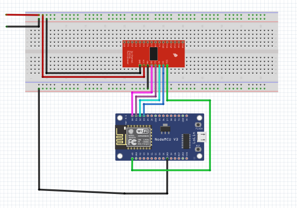

# NodeMCU-16-Pin-Mux
Increase the number of analog pins on nodeMCU using CD74HC4067

In order to design a multiplexed analog pin for node mcu we used a NodeMCU a CD74HC4067 ic and multiple sensors to get the output from and analyze there output. The sensors include four ZMPT101b voltage sensors, two acs 712 current sensors and two sct 013-000 current transformers which will be used to measure current.
